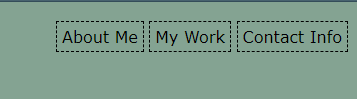

# BWang Portfolio

## Week 1 Module 2 Challenge - UCI Bootcamp

This was our second challenge project of our bootcamp. Overall, we were told to create our own porfolio website from scratch. I created a basic HTML structure and then worked to create the CSS styling that allowed me to have a functional website that was responsive when viewing from different sized screens. I used a lot of flexboxes to practice, but I still need to practice to make it look better and make the website more responsive.  

## Table of Contents

- [Installation](#installation)
- [Usage](#usage)
- [Credits](#credits)
- [License](#license)

## Installation

N/A

## Usage

The website is live [BWang Portfolio][https://wangbrian26.github.io/BWang-Portfolio]

This is my portfolio website where I will be displaying my work for future employers, family, and friends. There is a site navigation tool on the top of the page. Hovering over it enlarges to allow for better visibility. 

- Clicking on "About Me" takes you to a section that introduces you to who I am and what I hope to do. 
- Clicking on "My Work" takes you to a section that includes some examples of websites that I have built. If you click on the images of the website, it will take you to a live deployed version of that website. 
- Clicking on "Contact Info" takes you to a section that includes my contact information. 

## Credits

Thanks to Instructor Quinton Fults, TA Takara Truong, and TA Black Marcus for helping with the learning on these elements. Takara specifically helped a lot with the flexbox issues I was running into. 

## License

N/A